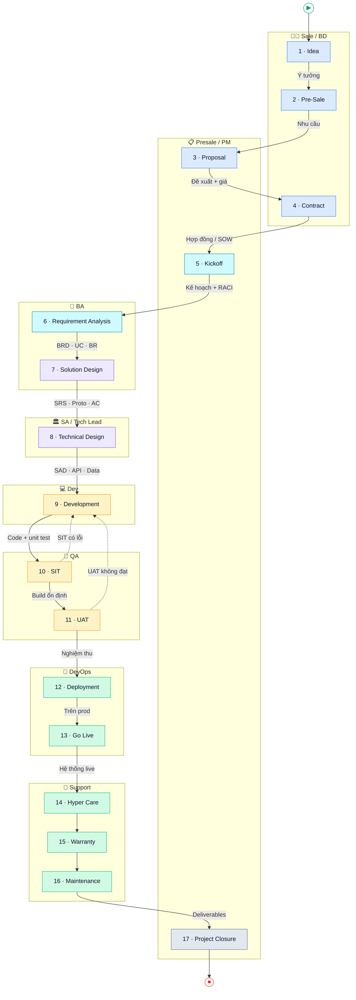

# Workshop 2
# Toàn cảnh một dự án — vòng đời đầy đủ, và AI đứng ở đâu

---

> ## 🗺️ Tổng quan nhanh (đọc trước)
>
> **Thời lượng:** 2 tiếng · **Kiểu buổi:** giới thiệu toàn cảnh — *chưa* thực hành trên dự án (thực hành bắt đầu từ buổi 3).
>
> **Một câu:** Một dự án phần mềm đi qua **17 chặng** từ một *ý tưởng* đến lúc *đóng dự án* — và AI là đồng nghiệp có mặt ở *cả chặng đường*, không chỉ chặng code.
>
> **17 chặng, gom 6 nhóm:**
> 1. **Bán hàng:** Idea · Pre-Sale · Proposal · Contract
> 2. **Khởi động & phân tích:** Kickoff · Requirement Analysis
> 3. **Thiết kế:** Solution Design · Technical Design
> 4. **Xây dựng & kiểm thử:** Development · SIT · UAT
> 5. **Triển khai & vận hành:** Deployment · Go Live · Hyper Care · Warranty · Maintenance
> 6. **Đóng dự án:** Project Closure
>
> **Học viên rời phòng với:** một **bản đồ chung** về vòng đời dự án (ai cũng thấy cả bức tranh, không chỉ mảnh của mình) + biết AI chạm vào đâu ở mỗi chặng.
>
> **Khung 2 tiếng (gợi ý):**
>
> | Phút | Nội dung |
> |------|----------|
> | 0–15 | Nhìn lại W1 + "một dự án đi qua *bao nhiêu* chặng?" → mở bản đồ 17 chặng |
> | 15–35 | **Nhóm 1 — Bán hàng:** Idea → Contract |
> | 35–52 | **Nhóm 2 — Khởi động & phân tích:** Kickoff · Requirement Analysis |
> | 52–72 | **Nhóm 3 — Thiết kế:** Solution · Technical Design |
> | 72–92 | **Nhóm 4 — Xây dựng & kiểm thử:** Development · SIT · UAT |
> | 92–108 | **Nhóm 5 — Triển khai & vận hành:** Deployment → Maintenance |
> | 108–115 | **Nhóm 6 — Đóng dự án** + AI là bộ nhớ xuyên suốt |
> | 115–120 | Reveal 3 trụ Minipower + teaser W3 |
>
> **Dẫn sang:** W3 — Minipower đóng gói vòng đời này thành pipeline có kỷ luật (6 phase · 19 DOC · 7 cổng), và bắt đầu thực hành trên dự án thật.

---

## Thời lượng

2 tiếng (120 phút)

---

## Mục tiêu

Sau workshop này, người tham gia:

- Thấy được **toàn cảnh đầy đủ** một dự án — đủ 17 chặng, không chỉ chặng mình phụ trách
- Biết mỗi chặng **làm gì, ai chịu trách nhiệm, đầu ra là gì, nỗi đau kinh điển ở đâu**
- Hiểu AI tham gia **cả vòng đời** — không phải chỉ để hỏi đáp hay viết code
- Hiểu Minipower là **AI Project Memory + AI Project Analyst + AI Project Assistant**

---

## Nỗi đau xử lý hôm nay

Buổi này *điểm danh* lại toàn bộ 12 nỗi đau của W1 — nhưng lần này gắn mỗi nỗi đau vào **đúng chặng** nó sinh ra.

---

# Mở đầu

## Nhìn lại Workshop 1

Buổi trước chúng ta đi qua câu chuyện dự án CRM ở công ty ABC.

Và một loạt nỗi đau: ghi họp không kịp, MOM ra muộn, requirement trôi, scope creep, onboard chậm, tri thức rải rác.

---

Cuối buổi, một kết luận:

Đây không phải vấn đề của AI.

Đây là vấn đề của **tri thức dự án**.

---

## Câu hỏi mở màn cho cả lớp

Một dự án phần mềm, từ một ý tưởng đến lúc kết thúc.

Đi qua **bao nhiêu chặng**?

---

Cho lớp trả lời. Ghi lên bảng.

Đa số sẽ nói: 4, 5, 6 chặng.

---

## Reveal

Thực tế: **17 chặng**.

---

Vì sao mọi người đoán ít hơn nhiều?

Vì mỗi người chỉ thấy **mảnh của mình**:

- Dev thấy: phân tích → code → test.
- Sale thấy: gặp khách → báo giá → ký.
- Support thấy: golive → bảo hành.

---

Ít ai thấy **cả 17 chặng**.

Đây chính là gốc của nỗi đau #3 (không rõ ai làm gì) và #12 (tìm tri thức khó):

Không ai giữ **cả bản đồ**.

---

Hôm nay chúng ta vẽ lại cả bản đồ. Và xem AI đứng ở đâu trong từng chặng.

---

# Bản đồ đầy đủ — 17 chặng (Ai · Input · Output)

> **Cách đọc sơ đồ (dạng BPMN):**
> - **Mỗi hàng (lane) = một vai trò** — chặng nằm ở lane người chịu trách nhiệm chính.
> - **Mũi tên liền** = sequence flow; **nhãn trên mũi tên = sản phẩm bàn giao** (output chặng trước → input chặng sau).
> - **Mũi tên đứt đỏ** = vòng rework (SIT có lỗi / UAT không đạt → quay lại Development).
> - **▶** = start event, **⏹** = end event. Màu ô theo 6 nhóm giai đoạn.



## Bảng chi tiết 17 chặng

| # | Chặng | Ai tham gia | Input | Output |
|---|-------|-------------|-------|--------|
| 1 | **Idea** | Sale/BD, Director | Nhu cầu thị trường / painpoint khách | Ý tưởng thô, lead |
| 2 | **Pre-Sale** | Sale, Presale/SA, BA | Lead, nhu cầu thô | Nhu cầu ghi nhận, demo, đánh giá khả thi sơ bộ |
| 3 | **Proposal** | Presale/SA, PM, BA, Sale | Nhu cầu đã ghi nhận | Đề xuất giải pháp, phạm vi sơ bộ, **báo giá sơ bộ** |
| 4 | **Contract** | Sale, Director/Legal, Khách | Proposal được khách chấp thuận | Hợp đồng, **SOW** (phạm vi thương mại đã ký) |
| 5 | **Kickoff** | PM, BA, SA, Dev Lead, QA, Khách | Hợp đồng / SOW | Kế hoạch tổng thể, **RACI**, kênh & lịch làm việc |
| 6 | **Requirement Analysis** | BA, Khách, SA | SOW, tài liệu khách, biên bản họp | **BRD**, Use Case, Business Rule, danh sách yêu cầu |
| 7 | **Solution Design** | BA, SA | Yêu cầu đã phân tích (BRD/UC/BR) | **Prototype**, **SRS** (FR), **Acceptance Criteria** |
| 8 | **Technical Design** | SA, Tech Lead | SRS, NFR, AC | **SAD**, ADR, Data Model, **API spec**, thiết kế tích hợp |
| 9 | **Development** | Dev, Dev Lead | SRS, AC, Technical Design | **Source code**, unit test, build |
| 10 | **SIT** | QA, Dev | Build, test case, điểm tích hợp | Kết quả SIT, defect log, **build ổn định** |
| 11 | **UAT** | Business/Khách, BA, QA | Build đã qua SIT, kịch bản UAT, AC | Biên bản UAT, **sign-off nghiệm thu** |
| 12 | **Deployment** | DevOps, SA | Build đã UAT, deployment guide, hạ tầng | Hệ thống cài trên **production** (chưa mở user), runbook |
| 13 | **Go Live** | DevOps, PM, SA, Khách | Hệ thống đã deploy, checklist go-live, kế hoạch cutover | **Hệ thống chạy thật**, biên bản cutover |
| 14 | **Hyper Care** | Support, Dev, BA | Hệ thống live, kênh báo sự cố | Hotfix, log sự cố, cập nhật tài liệu vận hành |
| 15 | **Warranty** | Support, Dev | Yêu cầu/lỗi trong hạn bảo hành | Bản vá lỗi, biên bản xử lý (trong cam kết) |
| 16 | **Maintenance** | Support, Dev, BA | CR, yêu cầu nâng cấp, lỗi ngoài warranty | **Change Request** đã xử lý, phiên bản mới, tài liệu cập nhật |
| 17 | **Project Closure** | PM, BA, Khách | Toàn bộ deliverable, biên bản nghiệm thu | Hồ sơ bàn giao, lessons learned, **baseline lưu trữ**, đóng hợp đồng |

> **Quy tắc vàng của cả bảng:** *Output của chặng N = Input của chặng N+1.* Nếu một chặng không tạo ra output rõ ràng (VD: Kickoff xong không có RACI), chặng sau bắt đầu bằng **giả định** — và đó là nơi nỗi đau W1 sinh ra.

---

Chúng ta đi từng nhóm, bám theo dự án CRM công ty ABC.

---

# Nhóm 1 — Bán hàng

*Idea · Pre-Sale · Proposal · Contract*

---

## Câu chuyện

Trước khi có dự án ABC, có một **ý tưởng**: "làm CRM để chăm khách tốt hơn."

Sale vào cuộc, gặp khách vài lần (Pre-Sale), viết đề xuất (Proposal), rồi hai bên ký (Contract).

---

| Chặng | Làm gì | Đầu ra |
|-------|--------|--------|
| **Idea** | Nảy sinh nhu cầu / cơ hội | Ý tưởng thô |
| **Pre-Sale** | Tiếp cận, đào nhu cầu sơ bộ, tạo niềm tin | Ghi nhận nhu cầu, demo |
| **Proposal** | Phác giải pháp + phạm vi + báo giá sơ bộ | Đề xuất giải pháp, báo giá |
| **Contract** | Chốt phạm vi thương mại, ký | Hợp đồng, SOW |

---

**Nỗi đau kinh điển (W1):** nhảy giải pháp sớm (chốt công nghệ khi chưa hiểu bài toán) · #10 báo giá cảm tính → chốt sai ngay từ hợp đồng.

---

**So sánh — trước & sau khi có AI:**

| Tính năng | ❌ Trước khi có AI | ✅ Với Minipower |
|-----------|-------------------|------------------|
| **Đánh giá cơ hội** | Quyết theo cảm tính / quan hệ, theo đuổi cả cơ hội ảo, nhảy giải pháp sớm | **Premise Check**: "vấn đề gốc là gì, ai đau, đo được không" — trước khi bỏ công |
| **Đề xuất giải pháp** | Một phương án theo ý người nói to nhất, bỏ sót ràng buộc vận hành / security | **Nhiều góc nhìn** phát biểu → nêu trade-off, không bỏ sót |
| **Báo giá** | Ước lượng cảm tính "khoảng 3 tháng", chốt sai ngay từ hợp đồng | Chấm **độ phức tạp** theo tiêu chí, con số trace về module |

---

> **Chốt Nhóm 1 cho lớp:** Báo giá trong Proposal là **sơ bộ** — ký xong mới phân tích chi tiết (Nhóm 2–3). Đây là lý do hợp đồng luôn có rủi ro, và vì sao phải ghi rõ **giả định** ngay từ đầu.

---

# Nhóm 2 — Khởi động & phân tích

*Kickoff · Requirement Analysis*

---

## Câu chuyện

Ký xong. Họp **Kickoff** — 10 người, khách nói 2 tiếng.

Rồi BA lao vào **phân tích yêu cầu** chi tiết.

*(Đây chính là buổi họp định mệnh của Workshop 1.)*

---

| Chặng | Làm gì | Ai | Đầu ra |
|-------|--------|----|--------|
| **Kickoff** | Khởi động, thống nhất mục tiêu, phân vai (RACI) | PM | Kế hoạch tổng thể, RACI |
| **Requirement Analysis** | Đào sâu yêu cầu, business rule, use case | BA | Danh sách yêu cầu, BR, UC |

---

**Nỗi đau kinh điển (W1):** #1 ghi họp không kịp · #2 MOM ra muộn · #3 không rõ ai duyệt cái gì · #11 họp quá nhiều.

---

**So sánh — trước & sau khi có AI:**

| Tính năng | ❌ Trước khi có AI | ✅ Với Minipower |
|-----------|-------------------|------------------|
| **Ghi chép cuộc họp** | BA ghi tay không kịp, sót requirement / BR / decision, tối về tua lại recording | Ghi trọn nội dung, tự phân loại: *"đơn > 10 triệu phải trưởng phòng duyệt"* → **Business Rule**; *"quý sau thêm cấp vùng"* → **Scope Change** |
| **Câu hỏi làm rõ** | Hỏi nhỏ giọt nhiều vòng, họp đi họp lại, MOM ra muộn | Bộ câu hỏi khảo sát **gửi một lượt** |
| **Ai duyệt cái gì** | Không rõ ai duyệt FRD / UAT / CR → đùn đẩy, việc treo | Làm rõ **RACI** ngay ở Kickoff |

---

# Nhóm 3 — Thiết kế

*Solution Design · Technical Design*

---

## Câu chuyện

Hiểu yêu cầu rồi.

Giờ thiết kế **hai tầng**: giải pháp nghiệp vụ trước, kỹ thuật sau.

---

| Chặng | Làm gì | Ai | Đầu ra |
|-------|--------|----|--------|
| **Solution Design** | Thiết kế giải pháp nghiệp vụ: luồng, màn hình, đặc tả chức năng | BA + SA | Prototype, SRS, AC |
| **Technical Design** | Thiết kế kỹ thuật: kiến trúc, data model, API | SA | SAD, ADR, Data Model, API |

---

**Nỗi đau kinh điển (W1):** #4 quá nhiều tài liệu copy lẫn nhau · #6 không ai nhớ vì sao thiết kế thế này.

---

**So sánh — trước & sau khi có AI:**

| Tính năng | ❌ Trước khi có AI | ✅ Với Minipower |
|-----------|-------------------|------------------|
| **Làm rõ yêu cầu mơ hồ** | *"Giảm giá VIP 10%"* mỗi người hiểu một kiểu, phát hiện sai tận lúc UAT | AI phản biện: VIP là ai? Cố định hay thay đổi? Sản phẩm nào? Có hạn dùng không? |
| **Quản lý bộ tài liệu** | Copy nội dung giữa BRD / FRD / Test → sửa một chỗ, quên chỗ khác → outdate | Nối bằng **mã số**, sửa một chỗ cả dây biết (không copy) |
| **Lưu lý do quyết định** | 6 tháng sau khách hỏi "sao làm thế này", cả team im lặng | **ADR** ghi bối cảnh + phương án + vì sao loại phương án khác |

---

> **Chốt Nhóm 3 cho lớp:** Tách **Solution Design** (nghiệp vụ — khách đọc được) khỏi **Technical Design** (kỹ thuật — dev đọc) là để khách gật đầu bằng thứ họ hiểu, trước khi đội kỹ thuật cắm đầu vào chi tiết.

---

# Nhóm 4 — Xây dựng & kiểm thử

*Development · SIT · UAT*

---

## Câu chuyện

Thiết kế xong. Dev code (**Development**).

Rồi kiểm thử **hai vòng**: nội bộ ghép hệ thống (**SIT**), rồi khách nghiệm thu (**UAT**).

---

| Chặng | Làm gì | Ai | Đầu ra |
|-------|--------|----|--------|
| **Development** | Hiện thực module, unit test | Dev | Code, unit test |
| **SIT** | Ghép các module + hệ ngoài, test tích hợp nội bộ | QA + Dev | Kết quả SIT, defect log |
| **UAT** | Khách test theo kịch bản, nghiệm thu | Business / khách | Biên bản UAT |

---

**Nỗi đau kinh điển (W1):** code sớm khi đặc tả chưa xong (viết lại từ đầu) · #7 mở 500 test case không biết cái nào kiểm yêu cầu nào.

---

**So sánh — trước & sau khi có AI:**

| Tính năng | ❌ Trước khi có AI | ✅ Với Minipower |
|-----------|-------------------|------------------|
| **Bắt đầu code** | Code khi đặc tả chưa xong → yêu cầu đổi → viết lại từ đầu, bay cả tuần | AI **dừng và liệt kê trọn gói** tiền đề còn thiếu (SRS, AC, thiết kế, API) trước khi code |
| **Thiết kế test case** | QA tự nghĩ, dễ thiếu negative / boundary, chỉ có happy path | Đề xuất đủ **positive · negative · boundary · exception** |
| **Độ phủ test** | Mở 500 test case không biết cái nào kiểm yêu cầu nào | Mỗi test **trace về AC** → thấy ngay yêu cầu nào chưa test (cả SIT lẫn UAT) |

---

> **Chốt Nhóm 4 cho lớp:** Phân biệt **SIT** (đội mình tự ghép và test — bắt lỗi tích hợp) với **UAT** (khách test — xác nhận đúng nhu cầu). Bỏ SIT, đẩy thẳng lỗi tích hợp sang khách = mất uy tín.

---

# Nhóm 5 — Triển khai & vận hành

*Deployment · Go Live · Hyper Care · Warranty · Maintenance*

---

## Câu chuyện

Nghiệm thu xong. Cài lên môi trường thật (**Deployment**), bật cho khách dùng (**Go Live**).

Rồi cụm hậu-golive mà nhiều người quên: **Hyper Care → Warranty → Maintenance**.

---

| Chặng | Làm gì | Ai | Đầu ra |
|-------|--------|----|--------|
| **Deployment** | Cài đặt lên production, cấu hình | DevOps + SA | Hệ thống đã cài, deployment guide |
| **Go Live** | Cắt chuyển, chính thức chạy thật | DevOps + PM | Hệ thống live, biên bản cutover |
| **Hyper Care** | Trực chăm sóc cường độ cao ngay sau golive | Support + Dev | Log sự cố, hotfix |
| **Warranty** | Bảo hành theo cam kết hợp đồng | Support | Xử lý lỗi trong hạn |
| **Maintenance** | Bảo trì, nâng cấp dài hạn | Support + Dev | CR, bản vá, phiên bản mới |

---

**Nỗi đau kinh điển (W1):** lên thật mới phát hiện không có đường quay lui · #5 tài liệu chết dần sau golive · #10 scope creep qua các yêu cầu bảo trì.

---

**So sánh — trước & sau khi có AI:**

| Tính năng | ❌ Trước khi có AI | ✅ Với Minipower |
|-----------|-------------------|------------------|
| **Quyết định go-live** | "Code xong là lên", không có đường quay lui, vỡ trận lúc 2h sáng | **Checklist go-live** + **dry-run rollback** bắt buộc trước khi lên |
| **Xử lý sự cố (Hyper Care)** | Lục email / chat tìm "ai yêu cầu, vì sao" giữa đêm | AI truy nguồn nhanh từ **bộ nhớ dự án** |
| **Thay đổi khi bảo trì** | Khách "tiện thể thêm" → không CR → scope creep + tài liệu chết dần | Mọi thay đổi qua **Change Request** + **phân tích tác động** |

---

> **Chốt Nhóm 5 cho lớp:** Go Live **không phải** là hết việc. **Hyper Care** (vài tuần đầu căng nhất) và **Warranty/Maintenance** mới là lúc tri thức dự án bị bào mòn nhanh nhất — nếu không có nơi lưu.

---

# Nhóm 6 — Đóng dự án

*Project Closure*

---

## Câu chuyện

Cuối cùng: chốt sổ.

Bàn giao chính thức, tổng kết bài học, giải phóng nguồn lực.

---

| Chặng | Làm gì | Ai | Đầu ra |
|-------|--------|----|--------|
| **Project Closure** | Bàn giao tài liệu, lessons learned, chốt baseline, đóng hợp đồng | PM + BA | Hồ sơ bàn giao, biên bản đóng dự án |

---

**Nỗi đau kinh điển (W1):** #8 người mới onboard 500 trang · #9 tri thức nằm trong đầu một người → nghỉ việc là mất.

---

**So sánh — trước & sau khi có AI:**

| Tính năng | ❌ Trước khi có AI | ✅ Với Minipower |
|-----------|-------------------|------------------|
| **Onboard / bàn giao** | Người mới đọc 500 trang, mất 2 tuần–2 tháng mới nắm việc | **Hỏi AI**, trả lời kèm trỏ tới cuộc họp / quyết định gốc |
| **Giữ tri thức khi người nghỉ** | Tri thức nằm trong đầu "Human Database", nghỉ việc là mất | **Baseline + memory** lưu lại — tri thức không đi theo người |

---

# Sợi chỉ xuyên suốt — AI là bộ nhớ của cả vòng đời

---

Nhìn lại bản đồ 17 chặng.

AI không xuất hiện ở **một** chặng.

AI có mặt **từ Idea đến Closure**.

---

Và quan trọng hơn:

AI **nhớ** điều xảy ra ở Pre-Sale khi ta đang ở Hyper Care.

---

Requirement A ở Requirement Analysis.

Nối tới business rule ở Solution Design.

Nối tới test case ở UAT.

Nối tới sự cố ở Hyper Care.

Nối tới bản vá ở Maintenance.

---

Đây là thứ rất ít dự án có được: **Bộ nhớ tập thể của dự án.**

---

## Một sự thay đổi lớn

Ngày xưa: người mạnh nhất dự án là người **nhớ nhiều nhất** (Human Database).

Người đó nghỉ → dự án mất trí nhớ.

---

Ngày nay: người mạnh nhất là người **khai thác tri thức nhanh nhất**.

Vì tri thức nằm trong hệ thống, không nằm trong đầu ai.

---

# Vậy Minipower là gì?

---

Không phải chatbot.

Không phải prompt.

Không phải ChatGPT wrapper.

---

Minipower có mặt ở cả vòng đời với 3 vai:

## AI Project Memory

Ghi nhớ và liên kết tri thức xuyên suốt 17 chặng.

## AI Project Analyst

Phân tích yêu cầu, phản biện, chấm độ phức tạp, phân tích tác động.

## AI Project Assistant

Hỗ trợ PM, BA, SA, QA, DEV, Support làm đúng việc ở đúng chặng.

---

# Tổng kết

---

Ba điều mang về:

- Một dự án đi qua **17 chặng** — ai cũng nên thấy cả bản đồ, không chỉ mảnh của mình.
- Mỗi chặng có **đầu ra riêng, người chịu trách nhiệm riêng, nỗi đau riêng**.
- AI là đồng nghiệp **từ Idea đến Closure** — nhớ, phân tích, hỗ trợ — không chỉ hỏi đáp hay code.

---

## Câu hỏi kết thúc

Bản đồ 17 chặng đã rõ.

Nhưng làm sao để cả team đi đúng bản đồ này mà **không lộn xộn** — ai chốt chặng nào, khi nào được sang chặng sau?

---

Minipower đóng gói vòng đời này thành một pipeline có kỷ luật: **6 giai đoạn, 19 tài liệu, 7 cổng người-chốt**.

👉 Đó là Workshop 3: **AI-Native Software Development — Bản đồ đường đi**. Và từ buổi đó, chúng ta **bắt đầu thực hành** trên dự án thật.

---

# Phụ lục — 17 chặng quy về pipeline Minipower

> Bảng này để giảng viên tham chiếu — cho lớp thấy 17 chặng "đời thực" tương ứng với gì trong Minipower, và học ở buổi nào. Minipower tập trung mạnh nhất từ **Kickoff → Maintenance**; các chặng bán hàng (Idea → Contract) được hỗ trợ ở mức discovery/đề xuất/ước lượng.

| Chặng | Giai đoạn Minipower | Tài liệu chính | Học sâu ở buổi |
|-------|---------------------|----------------|----------------|
| Idea | Deliberation (Premise Check) | — | W4 |
| Pre-Sale | Discovery (sơ bộ) | DOC-01–02 | W4 |
| Proposal | Discovery + Architecture (mức cao) + Planning (ước lượng sơ bộ) | DOC-01, 08, 14 | W4, W7, W8 |
| Contract | (thương mại — ngoài phạm vi tài liệu kỹ thuật) | SOW | — |
| Kickoff | Planning | DOC-15, RACI | W8 |
| Requirement Analysis | Requirements | DOC-03–07, 19 | W4, W5 |
| Solution Design | Requirements | DOC-06, 07, 19 | W5 |
| Technical Design | Architecture | DOC-08–12 | W7 |
| Development | Thực thi (readiness-gate) | code + unit test | W7 |
| SIT | Delivery | DOC-16 | W8 |
| UAT | Delivery | DOC-16 | W8 |
| Deployment | Delivery | DOC-17 | W8 |
| Go Live | Delivery | DOC-17 | W8 |
| Hyper Care | Delivery + Change control | DOC-18 | W8, W9 |
| Warranty | Change control | DOC-18 | W9 |
| Maintenance | Change control | DOC-18 | W9 |
| Project Closure | Delivery + Change control (baseline/handover) | tài liệu bàn giao | W9, W10 |

---

# Phụ lục — Prompt tạo ảnh

> Phong cách chung: điện ảnh, kể chuyện doanh nghiệp, ánh sáng công nghệ, giữ nguyên bộ nhân vật xuyên suốt khoá học, tỷ lệ 16:9.

```text
Bản đồ 17 chặng — Một tấm bản đồ hành trình phát sáng trải dài với mười bảy trạm dừng nối tiếp nhau từ "Idea" đến "Project Closure", được gom thành sáu cụm màu khác nhau, một AI hologram đồng hành suốt cả hành trình, tỷ lệ 16:9
```

```text
Mỗi người một mảnh — Nhiều thành viên dự án mỗi người cầm một mảnh ghép bản đồ khác nhau, không ai ghép được bức tranh hoàn chỉnh, ở giữa AI hologram ghép tất cả các mảnh lại thành một bản đồ mười bảy chặng duy nhất phát sáng, tỷ lệ 16:9
```

```text
Nhóm bán hàng — Bốn trạm đầu Idea, Pre-Sale, Proposal, Contract phát sáng, sale và khách hàng bắt tay ở cổng hợp đồng, AI đứng bên phân tích độ phức tạp và chi phí hiện lên dưới dạng biểu đồ, tỷ lệ 16:9
```

```text
Hai tầng thiết kế — Bên trên tầng Solution Design với màn hình và luồng nghiệp vụ khách hàng gật đầu hiểu được, bên dưới tầng Technical Design với kiến trúc và API cho đội kỹ thuật, hai tầng nối nhau bằng ánh sáng, tỷ lệ 16:9
```

```text
SIT và UAT — Hai vòng kiểm thử: vòng trong đội kỹ thuật tự ghép các mảnh hệ thống và soi lỗi (SIT), vòng ngoài khách hàng ngồi nghiệm thu theo kịch bản (UAT), các test case nối lên yêu cầu bằng sợi chỉ ánh sáng, tỷ lệ 16:9
```

```text
Hậu Go Live — Sau khoảnh khắc go live rực sáng là ba trạm Hyper Care, Warranty, Maintenance nơi đội support trực chiến, AI truy vết nhanh nguồn gốc mỗi sự cố từ bộ nhớ dự án, không ai phải lục email lúc nửa đêm, tỷ lệ 16:9
```

```text
Đóng dự án & bộ nhớ — Dự án khép lại nhưng toàn bộ tri thức mười bảy chặng vẫn phát sáng an toàn trong hệ thống trung tâm, người mới bước vào chỉ cần hỏi AI thay vì đọc núi tài liệu, tỷ lệ 16:9
```

```text
Ba trụ Minipower — Ba cột trụ phát sáng AI Project Memory, AI Project Analyst, AI Project Assistant nâng đỡ toàn bộ hành trình mười bảy chặng của dự án phần mềm hiện đại, tỷ lệ 16:9
```
