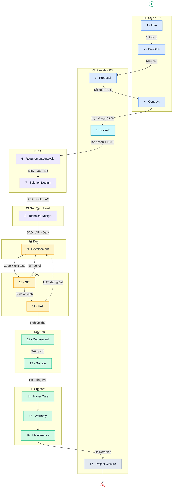

# Workshop 2
# Toàn cảnh một dự án — vòng đời đầy đủ, và AI đứng ở đâu

---

> ## 🗺️ Tổng quan nhanh (đọc trước)
>
> **Thời lượng:** 2 tiếng · **Kiểu buổi:** giới thiệu toàn cảnh — *chưa* thực hành trên dự án (thực hành bắt đầu từ buổi 3).
>
> **Một câu:** Một dự án phần mềm đi qua **17 chặng** từ một *ý tưởng* đến lúc *đóng dự án* — và AI là đồng nghiệp có mặt ở *cả chặng đường*, không chỉ chặng code.
>
> **Mạch buổi học (quan trọng):** *Không* mở bản đồ ngay. Bắt đầu bằng câu hỏi "một dự án gồm những bước nào?", thu câu trả lời rời rạc của cả lớp thành **những mảnh ghép**, rồi cùng nhau đi tìm câu trả lời qua 6 nhóm. **Chỉ khi đi hết** mới ghép đủ **17 chặng** — đó là lúc lộ ra: AI giữ cả bản đồ, là *kho tri thức của cả vòng đời*.
>
> **17 chặng, gom 6 nhóm (thứ tự kể chuyện):**
> 1. **Bán hàng:** Idea · Pre-Sale · Proposal · Contract
> 2. **Khởi động:** Kickoff
> 3. **Phân tích & Thiết kế:** Requirement Analysis · Solution Design · Technical Design
> 4. **Xây dựng & Kiểm thử:** Development · SIT · UAT
> 5. **Triển khai & Vận hành:** Deployment · Go Live · Hyper Care · Warranty · Maintenance
> 6. **Nghiệm thu & Bàn giao:** Project Closure
>
> **Học viên rời phòng với:** một **bản đồ chung** về vòng đời dự án (ai cũng thấy cả bức tranh, không chỉ mảnh của mình) + biết AI chạm vào đâu ở mỗi chặng.
>
> **Khung 2 tiếng (gợi ý):**
>
> | Phút | Nội dung |
> |------|----------|
> | 0–12 | Nhìn lại W1 + câu hỏi "một dự án gồm **những bước nào**?" → thu mảnh ghép rời rạc → "cùng đi tìm câu trả lời" |
> | 12–30 | **Nhóm 1 — Bán hàng:** Idea → Contract |
> | 30–40 | **Nhóm 2 — Khởi động:** Kickoff (buổi họp định mệnh) |
> | 40–60 | **Nhóm 3 — Phân tích & Thiết kế:** Requirement Analysis · Solution · Technical Design |
> | 60–80 | **Nhóm 4 — Xây dựng & Kiểm thử:** Development · SIT · UAT |
> | 80–98 | **Nhóm 5 — Triển khai & Vận hành:** Deployment → Maintenance |
> | 98–105 | **Nhóm 6 — Nghiệm thu & Bàn giao:** Project Closure |
> | 105–113 | **Ghép đủ mảnh → hiện bản đồ 17 chặng** + AI là bộ nhớ xuyên suốt |
> | 113–120 | Hé lộ Minipower = AI Project Assistant + teaser W3 |
>
> **Dẫn sang:** W3 — Minipower đóng gói vòng đời này thành pipeline có kỷ luật (6 phase · 19 DOC · 7 cổng), và bắt đầu thực hành trên dự án thật.

---

## Thời lượng

2 tiếng (120 phút)

---

## Mục tiêu

Sau workshop này, người tham gia:

- Thấy được **toàn cảnh đầy đủ** một dự án — đủ 17 chặng, không chỉ chặng mình phụ trách
- Biết mỗi chặng **làm gì, ai chịu trách nhiệm, đầu ra là gì, nỗi đau kinh điển ở đâu**
- Hiểu AI tham gia **cả vòng đời** — không phải chỉ để hỏi đáp hay viết code
- Hiểu Minipower hiện là một **AI Project Assistant** — quản lý tài liệu và hỗ trợ quản lý công việc của cả dự án

---

## Nỗi đau xử lý hôm nay

Buổi này *điểm danh* lại toàn bộ 12 nỗi đau của W1 — nhưng lần này gắn mỗi nỗi đau vào **đúng chặng** nó sinh ra.

---

# Mở đầu

## Nhìn lại Workshop 1

Buổi trước chúng ta đi qua câu chuyện dự án CRM ở công ty ABC.

Và một loạt nỗi đau: ghi họp không kịp, MoM ra muộn, requirement trôi, scope creep, onboard chậm, tri thức rải rác.

---

Cuối buổi, một kết luận:

Đây không phải vấn đề của AI.

Đây là vấn đề của **tri thức dự án**.

---

## Câu hỏi mở màn cho cả lớp

Trước khi đi tiếp, một câu hỏi.

**Mỗi dự án phần mềm sẽ có những bước nào?**

---

Cho lớp trả lời. **Gọi từng người** — mỗi người nói một bước họ nghĩ tới.

Trên slide, mỗi câu trả lời hiện lên thành **một mảnh ghép rời**, nằm rải rác, chưa nối vào nhau:

- Người thì nói "phân tích", "code", "test".
- Người thì nói "gặp khách", "báo giá", "ký hợp đồng".
- Người thì nói "golive", "bảo hành".

---

Nhìn lên màn hình: cả chục mảnh ghép, mỗi người một góc.

Nhưng **chưa ai ghép được bức tranh đủ**.

*(Đừng vội chốt đúng/sai. Đừng nói con số.)*

---

Vì sao vậy?

Vì mỗi người chỉ thấy **mảnh của mình**:

- Dev thấy: phân tích → code → test.
- Sale thấy: gặp khách → báo giá → ký.
- Support thấy: golive → bảo hành.

Đây chính là gốc của nỗi đau #3 (không rõ ai làm gì) và #12 (tìm tri thức khó): **không ai giữ cả bản đồ.**

---

## Câu dẫn dắt

Vậy bức tranh đầy đủ trông thế nào?

> **Ok, chúng ta cùng bắt đầu đi tìm câu trả lời.**

Đi theo đúng đường một dự án thật đi — dự án CRM công ty ABC — từng nhóm một. Ghép dần từng mảnh. Cuối hành trình, ta sẽ có cả bản đồ.

---

# Nhóm 1 — Bán hàng

*Idea · Pre-Sale · Proposal · Contract*

---

## Câu chuyện

Trước khi có dự án ABC, có một **ý tưởng**: "làm CRM để chăm khách tốt hơn."

Sale vào cuộc, gặp khách vài lần (Pre-Sale), viết đề xuất (Proposal), rồi hai bên ký (Contract).

> ⚠️ **Điểm đau W1 ở đây:** 12 nỗi đau của W1 *chưa* nổ ra ở khâu bán hàng — nhưng mầm được gieo ngay lúc này. Nhảy giải pháp sớm và báo giá cảm tính làm hợp đồng chốt sai, để rồi bung thành **scope creep (#10)** ở các chặng phía sau.

---

| Chặng | Làm gì | Ai | Đầu ra |
|-------|--------|----|--------|
| **Idea** | Nảy sinh nhu cầu / cơ hội | Sale / BD | Ý tưởng thô |
| **Pre-Sale** | Họp tiếp cận, khai thác nhu cầu sơ bộ, tạo niềm tin | Sale | Kịch bản demo sản phẩm, kinh nghiệm triển khai, biên bản họp |
| **Proposal** | Phác giải pháp + phạm vi + báo giá sơ bộ | Presale / PM | Đề xuất giải pháp, báo giá |
| **Contract** | Chốt phạm vi thương mại, ký | Sale / PM | Hợp đồng, SOW |

---

**So sánh — trước & sau khi có AI:**

| Tính năng | ❌ Trước khi có AI | ✅ Với Minipower |
|-----------|-------------------|------------------|
| **Đánh giá cơ hội** *(chỉ áp dụng cho dự án nội bộ — dự án cho khách hàng bên ngoài không cần bước này)* | Khảo sát, đánh giá thủ công, chậm | Khảo sát **nhanh hơn**: hỏi đáp trực tiếp với AI ngay trên ý tưởng sơ khai |
| **Đề xuất giải pháp** | • Xây dựng giải pháp tốn **nhiều ngày**, qua nhiều bước rà soát<br>• Yêu cầu **không được định danh, không phân loại**, khó truy vết<br>• Tài liệu, sơ đồ lưu **rời rạc**: Google Drive, Draw.io... | • Dựng bản đề xuất **nhanh**, AI rà soát cùng<br>• Trả lời được câu hỏi *"Giải pháp này giải quyết được FR và NFR nào?"* bằng **sơ đồ truy vết, định danh yêu cầu**<br>• Tài liệu **tập trung một nơi**, liên kết bằng mã số |
| **Báo giá** | • Mất thời gian **copy-paste / viết lại** từ tài liệu khảo sát<br>• Qua **nhiều vòng rà soát** cho đủ nội dung, đa góc nhìn<br>• Báo giá đổi qua **nhiều phiên bản**, không ghi lại **vì sao thay đổi giá** | • Tự tổng hợp từ tài liệu khảo sát, **không chép tay**<br>• Chấm **độ phức tạp** đa góc nhìn, giảm vòng rà soát<br>• Lưu **lịch sử từng phiên bản giá + lý do thay đổi**<br>• Trả lời được câu hỏi *"Vì sao giá chức năng này cao vậy?"* bằng **sơ đồ truy vết, định danh từ yêu cầu đến giải pháp** |
| **Kế hoạch triển khai** | • Copy-paste, viết lại từ tài liệu khảo sát<br>• Chỉnh sửa nhiều lần trên Excel, **không có sự liên kết** | • Tự tổng hợp, **không chép tay**<br>• Truy vết *"phát triển những FR / NFR nào"* bằng **ma trận định danh** |

> 💬 **Prompt mẫu (thử với Minipower):**
> - *"Từ ý tưởng CRM chăm sóc khách hàng, đặt 10 câu hỏi khảo sát làm rõ nhu cầu và tính khả thi."*
> - *"Lập đề xuất giải pháp cho yêu cầu [X], gán mã định danh từng yêu cầu và chỉ rõ giải pháp đáp ứng FR / NFR nào."*
> - *"Chấm độ phức tạp và báo giá các chức năng đã khảo sát; vẽ sơ đồ truy vết vì sao chức năng [Y] có giá cao."*

---

> **Chốt Nhóm 1 cho lớp:** Báo giá trong Proposal là **sơ bộ** — ký xong mới phân tích chi tiết (Nhóm 2–3). Đây là lý do hợp đồng luôn có rủi ro, và vì sao phải ghi rõ **giả định** ngay từ đầu.
>
> *Ghép mảnh: 4 mảnh đầu đã vào chỗ — Idea · Pre-Sale · Proposal · Contract.*

---

# Nhóm 2 — Khởi động

*Kickoff*

---

## Câu chuyện

Ký xong. Họp **Kickoff** — 10 người, khách nói 2 tiếng.

*(Đây chính là buổi họp định mệnh của Workshop 1.)*

> ⚠️ **Điểm đau W1 hiện ra ở đây:** biên bản kickoff — cả với **khách hàng** lẫn **nội bộ công ty** — **chưa đạt chuẩn RACI**, nên vai trò và trách nhiệm của từng stakeholder còn mờ, dễ đùn đẩy về sau (**#3**). *(Chuyện ghi họp không kịp, MoM ra muộn, ai duyệt FRD/UAT/CR... không nằm ở đây — chúng xuất hiện ở Nhóm 3.)*
>
> ⏳ **Đau chưa? Chưa — nhưng là quả bom hẹn giờ.** Vì **chưa có trợ lý tài liệu**, biên bản và tài liệu kickoff bị lưu **rời rạc** (Google Drive, kênh chat, Google Sheet), và mọi thứ **phụ thuộc vào con người nhắc nhở**: nhớ file nằm ở đâu, nhớ ai phải làm gì, nhớ đã chốt cái gì. Lúc kickoff còn ít tài liệu nên chưa thấy đau — nhưng càng về sau tài liệu càng nhiều, người nhắc càng quên, đó là lúc **phát nổ**: tìm không ra, không ai nhớ, việc treo.

---

| Chặng | Làm gì | Ai | Đầu ra |
|-------|--------|----|--------|
| **Kickoff** | Khởi động, thống nhất mục tiêu, phân vai (RACI) | PM | Kế hoạch tổng thể, RACI |

---

**So sánh — trước & sau khi có AI:**

| Tính năng | ❌ Trước khi có AI | ✅ Với Minipower |
|-----------|-------------------|------------------|
| **Biên bản kickoff** | Biên bản kickoff (với khách & nội bộ) **chưa đạt chuẩn RACI**, ghi chung chung — ai cũng "có liên quan" nhưng không rõ ai chịu | Soạn biên bản kickoff **theo chuẩn RACI** — mỗi hạng mục rõ ai **R**esponsible (người thực hiện) / **A**ccountable (người chịu trách nhiệm cuối) / **C**onsulted (người được hỏi ý kiến) / **I**nformed (người được thông báo) |
| **Vai trò & trách nhiệm stakeholder** | Vai trò từng bên (khách, PM, BA, SA, Dev, QA) mờ nhạt → đùn đẩy, việc treo, đổ lỗi | Làm rõ **vai trò & trách nhiệm** từng stakeholder ngay ở kickoff, chốt trước khi sang phân tích |
| **Tài liệu** | Lưu tài liệu rải rác trên Google Drive, kênh giao tiếp, tất cả nhét trong Google Sheet; tên file không thể hiện hết nội dung nên khó tìm, không nhớ nằm ở folder nào | **Trợ lý tài liệu** của toàn bộ dự án — tập trung một nơi, tìm bằng nội dung thay vì nhớ tên file / folder |

> 💬 **Prompt mẫu (thử với Minipower):**
> - *"Soạn biên bản kickoff dự án CRM theo chuẩn RACI, gán R / A / C / I cho từng hạng mục và stakeholder."*
> - *"Lập bảng RACI cho khách, PM, BA, SA, Dev, QA — chỉ rõ ai chịu trách nhiệm cuối cho mỗi đầu việc."*
> - *"Tìm giúp tôi biên bản kickoff và tài liệu cam kết phạm vi mới nhất của dự án."*

---

> **Chốt Nhóm 2 cho lớp:** Kickoff quyết định cả dự án đi đúng hay đi lệch. Nếu biên bản kickoff không đạt chuẩn RACI, vai trò từng stakeholder còn mờ, **mọi chặng phía sau xây trên cát**.
>
> *Ghép mảnh: mảnh Kickoff vào chỗ.*

---

# Nhóm 3 — Phân tích & Thiết kế

*Requirement Analysis · Solution Design · Technical Design*

---

## Câu chuyện

Kickoff xong, BA lao vào **phân tích yêu cầu** chi tiết.

Hiểu yêu cầu rồi mới thiết kế **hai tầng**: giải pháp nghiệp vụ trước, kỹ thuật sau.

> ⚠️ **Điểm đau W1 hiện ra ở đây:** BA ghi các buổi họp phân tích **không kịp** (**#1**), biên bản / MoM ra muộn (**#2**); yêu cầu mơ hồ mỗi người hiểu một kiểu nên phải **hỏi đi hỏi lại, họp nhiều vòng** (**#11**); **không rõ ai duyệt FRD / UAT / CR** (**#3**); tài liệu BRD / FRD / Test copy lẫn nhau (**#4**); tài liệu bắt đầu chết dần (**#5**); và 6 tháng sau không ai nhớ vì sao quyết định thế này (**#6**).

---

| Chặng | Làm gì | Ai | Đầu ra |
|-------|--------|----|--------|
| **Requirement Analysis** | Đào sâu yêu cầu, business rule, use case | BA | BRD, Business Rule, Use Case |
| **Solution Design** | Thiết kế giải pháp nghiệp vụ: luồng, màn hình, đặc tả chức năng | BA + SA | Prototype, SRS, AC |
| **Technical Design** | Thiết kế kỹ thuật: kiến trúc, data model, API | SA | SAD, ADR, Data Model, API |

---

**So sánh — trước & sau khi có AI:**

| Tính năng | ❌ Trước khi có AI | ✅ Với Minipower |
|-----------|-------------------|------------------|
| **Ghi chép cuộc họp** | BA ghi tay không kịp, sót requirement / BR / decision, tối về tua lại recording | Ghi trọn nội dung, tự phân loại: *"đơn > 10 triệu phải trưởng phòng duyệt"* → **Business Rule**; *"quý sau thêm cấp vùng"* → **Scope Change** |
| **Câu hỏi làm rõ** | Hỏi nhỏ giọt nhiều vòng, họp đi họp lại, MoM ra muộn | Bộ câu hỏi khảo sát **gửi một lượt** |
| **Ai duyệt tài liệu** | Không rõ ai duyệt FRD / UAT / CR → đùn đẩy, việc treo | Gắn **người duyệt (RACI cấp tài liệu)** vào từng FRD / UAT / CR |
| **Làm rõ yêu cầu mơ hồ** | *"Giảm giá VIP 10%"* mỗi người hiểu một kiểu, phát hiện sai tận lúc UAT | AI phản biện: VIP là ai? Cố định hay thay đổi? Sản phẩm nào? Có hạn dùng không? |
| **Quản lý bộ tài liệu** | Copy nội dung giữa BRD / FRD / Test → sửa một chỗ, quên chỗ khác → outdate | Nối bằng **mã số**, sửa một chỗ cả dây biết (không copy) |
| **Lưu lý do quyết định** | 6 tháng sau khách hỏi "sao làm thế này", cả team im lặng | **ADR** ghi bối cảnh + phương án + vì sao loại phương án khác |

> 💬 **Prompt mẫu (thử với Minipower):**
> - *"Từ bản ghi cuộc họp này, trích và phân loại thành Requirement, Business Rule, Decision, Scope Change."*
> - *"Yêu cầu 'giảm giá VIP 10%' mơ hồ chỗ nào? Liệt kê câu hỏi cần làm rõ, gộp thành một phiếu gửi khách một lượt."*
> - *"Requirement REQ-012 nối tới business rule, use case và test case nào? Viết ADR cho quyết định thiết kế liên quan."*

---

> **Chốt Nhóm 3 cho lớp:** Tách **Solution Design** (nghiệp vụ — khách đọc được) khỏi **Technical Design** (kỹ thuật — dev đọc) là để khách gật đầu bằng thứ họ hiểu, trước khi đội kỹ thuật cắm đầu vào chi tiết.
>
> *Ghép mảnh: 3 mảnh phân tích – thiết kế vào chỗ.*

---

# Nhóm 4 — Xây dựng & Kiểm thử

*Development · SIT · UAT*

---

## Câu chuyện

Thiết kế xong. Dev code (**Development**).

Rồi kiểm thử **hai vòng**: nội bộ ghép hệ thống (**SIT**), rồi khách nghiệm thu (**UAT**).

> ⚠️ **Điểm đau W1 hiện ra ở đây:** BA họp và phản hồi MoM **chậm**, dev chờ không được; đội **bỏ qua FRD / SRS**, lấy thẳng BRD dựng SAD rồi **code luôn**; code khi đặc tả chưa xong nên phải viết lại từ đầu; và mở 500 test case không biết cái nào kiểm yêu cầu nào (**#7**).

---

| Chặng | Làm gì | Ai | Đầu ra |
|-------|--------|----|--------|
| **Development** | Hiện thực module, unit test | Dev | Code, unit test |
| **SIT** | Ghép các module + hệ ngoài, test tích hợp nội bộ | QA + Dev | Kết quả SIT, defect log |
| **UAT** | Khách test theo kịch bản, nghiệm thu | Business / khách | Biên bản UAT |

---

**So sánh — trước & sau khi có AI:**

| Tính năng | ❌ Trước khi có AI | ✅ Với Minipower |
|-----------|-------------------|------------------|
| **Bắt đầu code** | Bỏ qua FRD / SRS, từ BRD nhảy thẳng sang SAD và code; đặc tả chưa xong → yêu cầu đổi → viết lại từ đầu, bay cả tuần | AI **dừng và liệt kê trọn gói** tiền đề còn thiếu (SRS, AC, thiết kế, API) trước khi code |
| **Thiết kế test case** | QA tự nghĩ, dễ thiếu negative / boundary, chỉ có happy path | Đề xuất đủ **positive · negative · boundary · exception** |
| **Độ phủ test** | Mở 500 test case không biết cái nào kiểm yêu cầu nào | Mỗi test **trace về AC** → thấy ngay yêu cầu nào chưa test (cả SIT lẫn UAT) |

> 💬 **Prompt mẫu (thử với Minipower):**
> - *"Trước khi code module [X], kiểm tra đã đủ SRS, AC, Technical Design, API spec chưa — thiếu gì liệt kê ra."*
> - *"Sinh bộ test case cho AC-045 gồm đủ positive, negative, boundary, exception."*
> - *"Những AC nào của module [X] chưa có test case (cả SIT lẫn UAT)?"*

---

> **Chốt Nhóm 4 cho lớp:** Phân biệt **SIT** (đội mình tự ghép và test — bắt lỗi tích hợp) với **UAT** (khách test — xác nhận đúng nhu cầu). Bỏ SIT, đẩy thẳng lỗi tích hợp sang khách = mất uy tín.
>
> *Ghép mảnh: 3 mảnh xây dựng – kiểm thử vào chỗ.*

---

# Nhóm 5 — Triển khai & Vận hành

*Deployment · Go Live · Hyper Care · Warranty · Maintenance*

---

## Câu chuyện

Nghiệm thu xong. Cài lên môi trường thật (**Deployment**), bật cho khách dùng (**Go Live**).

Rồi cụm hậu-golive mà nhiều người quên: **Hyper Care → Warranty → Maintenance**.

> ⚠️ **Điểm đau W1 hiện ra ở đây:** lên thật mới phát hiện không có đường quay lui; tài liệu chết dần sau go-live (**#5**); khách "tiện thể thêm" qua các yêu cầu bảo trì → **scope creep (#10)**.

---

| Chặng | Làm gì | Ai | Đầu ra |
|-------|--------|----|--------|
| **Deployment** | Cài đặt lên production, cấu hình | DevOps + SA | Hệ thống đã cài, deployment guide |
| **Go Live** | Cắt chuyển, chính thức chạy thật | DevOps + PM | Hệ thống live, biên bản cutover |
| **Hyper Care** | Trực chăm sóc cường độ cao ngay sau go-live | Support + Dev | Log sự cố, hotfix |
| **Warranty** | Bảo hành theo cam kết hợp đồng | Support | Xử lý lỗi trong hạn |
| **Maintenance** | Bảo trì, nâng cấp dài hạn | Support + Dev | CR, bản vá, phiên bản mới |

---

**So sánh — trước & sau khi có AI:**

| Tính năng | ❌ Trước khi có AI | ✅ Với Minipower |
|-----------|-------------------|------------------|
| **Quyết định go-live** | "Code xong là lên", không có đường quay lui, vỡ trận lúc 2h sáng | **Checklist go-live** + **dry-run rollback** bắt buộc trước khi lên |
| **Xử lý sự cố (Hyper Care)** | Lục email / chat tìm "ai yêu cầu, vì sao" giữa đêm | AI truy nguồn nhanh từ **bộ nhớ dự án** |
| **Thay đổi khi bảo trì** | Khách "tiện thể thêm" → không CR → scope creep + tài liệu chết dần | Mọi thay đổi qua **Change Request** + **phân tích tác động** |

> 💬 **Prompt mẫu (thử với Minipower):**
> - *"Lập checklist go-live cho dự án CRM kèm kịch bản dry-run rollback."*
> - *"Sự cố ở chức năng [X] lúc golive: truy nguồn yêu cầu gốc, ai đã quyết định, bản vá liên quan."*
> - *"Khách xin thêm [Y] khi bảo trì — tạo Change Request và phân tích tác động tới các module liên quan."*

---

> **Chốt Nhóm 5 cho lớp:** Go Live **không phải** là hết việc. **Hyper Care** (vài tuần đầu căng nhất) và **Warranty/Maintenance** mới là lúc tri thức dự án bị bào mòn nhanh nhất — nếu không có nơi lưu.
>
> *Ghép mảnh: 5 mảnh triển khai – vận hành vào chỗ.*

---

# Nhóm 6 — Nghiệm thu & Bàn giao

*Project Closure*

---

## Câu chuyện

Cuối cùng: nghiệm thu tổng thể và **chốt sổ**.

Bàn giao chính thức, tổng kết bài học, giải phóng nguồn lực.

> ⚠️ **Điểm đau W1 hiện ra ở đây:** người mới phải đọc 500 trang mới nắm việc (**#8**); tri thức nằm trong đầu người nhớ nhiều nhất, nghỉ là mất (**#9**); và muốn tìm lại một quyết định cũ thì cực khó (**#12**).

---

| Chặng | Làm gì | Ai | Đầu ra |
|-------|--------|----|--------|
| **Project Closure** | Bàn giao tài liệu, lessons learned, chốt baseline, đóng hợp đồng | PM + BA | Hồ sơ bàn giao, biên bản đóng dự án |

---

**So sánh — trước & sau khi có AI:**

| Tính năng | ❌ Trước khi có AI | ✅ Với Minipower |
|-----------|-------------------|------------------|
| **Onboard / bàn giao** | Người mới đọc 500 trang, mất 2 tuần–2 tháng mới nắm việc | **Hỏi AI**, trả lời kèm trỏ tới cuộc họp / quyết định gốc |
| **Giữ tri thức khi người nghỉ** | Tri thức nằm trong đầu "Human Database", nghỉ việc là mất | **Baseline + memory** lưu lại — tri thức không đi theo người |

> 💬 **Prompt mẫu (thử với Minipower):**
> - *"Tóm tắt cho người mới: dự án CRM có những module nào, quyết định lớn nào, trỏ tới tài liệu gốc."*
> - *"Chốt baseline bàn giao: liệt kê toàn bộ deliverable, biên bản nghiệm thu và lessons learned."*
> - *"[Người phụ trách module X] sắp nghỉ — tổng hợp toàn bộ tri thức, quyết định và điểm cần lưu ý của module X."*

---

> **Chốt Nhóm 6 cho lớp:** Bàn giao không chỉ là gửi file. Nếu tri thức vẫn nằm trong đầu người, "đóng dự án" chỉ là hẹn giờ cho lần mất trí nhớ tiếp theo.
>
> *Ghép mảnh: mảnh cuối cùng vào chỗ. Bức tranh đã đủ.*

---

# Ghép lại tất cả — Bản đồ đầy đủ 17 chặng

---

Nãy giờ chúng ta đã đi hết **sáu nhóm**, bám theo dự án CRM công ty ABC.

Giờ ghép **tất cả các mảnh** lại.

---

Đầu buổi, cả phòng chỉ ghép được vài mảnh rời. Bây giờ, đủ cả:

**17 chặng — từ Idea đến Project Closure.**

---

> **Cách đọc sơ đồ (dạng BPMN):**
> - **Mỗi hàng (lane) = một vai trò** — chặng nằm ở lane người chịu trách nhiệm chính.
> - **Mũi tên liền** = sequence flow; **nhãn trên mũi tên = sản phẩm bàn giao** (output chặng trước → input chặng sau).
> - **Mũi tên đứt đỏ** = vòng rework (SIT có lỗi / UAT không đạt → quay lại Development).
> - **▶** = start event, **⏹** = end event. Màu ô theo 6 nhóm giai đoạn.



## Bảng chi tiết 17 chặng

| # | Chặng | Ai tham gia | Input | Output |
|---|-------|-------------|-------|--------|
| 1 | **Idea** | Sale/BD, Director | Nhu cầu thị trường / painpoint khách | Ý tưởng thô, lead |
| 2 | **Pre-Sale** | Sale, Presale/SA, BA | Lead, nhu cầu thô | Kịch bản demo sản phẩm, kinh nghiệm triển khai, **biên bản họp tiếp cận** |
| 3 | **Proposal** | Presale/SA, PM, BA, Sale | Nhu cầu đã ghi nhận | Đề xuất giải pháp, phạm vi sơ bộ, **báo giá sơ bộ** |
| 4 | **Contract** | Sale, Director/Legal, Khách | Proposal được khách chấp thuận | Hợp đồng, **SOW** (phạm vi thương mại đã ký) |
| 5 | **Kickoff** | PM, BA, SA, Dev Lead, QA, Khách | Hợp đồng / SOW | Kế hoạch tổng thể, **RACI**, kênh & lịch làm việc |
| 6 | **Requirement Analysis** | BA, Khách, SA | SOW, tài liệu khách, biên bản họp | **BRD**, Use Case, Business Rule, danh sách yêu cầu |
| 7 | **Solution Design** | BA, SA | Yêu cầu đã phân tích (BRD/UC/BR) | **Prototype**, **SRS** (FR), **Acceptance Criteria** |
| 8 | **Technical Design** | SA, Tech Lead | SRS, NFR, AC | **SAD**, ADR, Data Model, **API spec**, thiết kế tích hợp |
| 9 | **Development** | Dev, Dev Lead | SRS, AC, Technical Design | **Source code**, unit test, build |
| 10 | **SIT** | QA, Dev | Build, test case, điểm tích hợp | Kết quả SIT, defect log, **build ổn định** |
| 11 | **UAT** | Business/Khách, BA, QA | Build đã qua SIT, kịch bản UAT, AC | Biên bản UAT, **sign-off nghiệm thu** |
| 12 | **Deployment** | DevOps, SA | Build đã UAT, deployment guide, hạ tầng | Hệ thống cài trên **production** (chưa mở user), runbook |
| 13 | **Go Live** | DevOps, PM, SA, Khách | Hệ thống đã deploy, checklist go-live, kế hoạch cutover | **Hệ thống chạy thật**, biên bản cutover |
| 14 | **Hyper Care** | Support, Dev, BA | Hệ thống live, kênh báo sự cố | Hotfix, log sự cố, cập nhật tài liệu vận hành |
| 15 | **Warranty** | Support, Dev | Yêu cầu/lỗi trong hạn bảo hành | Bản vá lỗi, biên bản xử lý (trong cam kết) |
| 16 | **Maintenance** | Support, Dev, BA | CR, yêu cầu nâng cấp, lỗi ngoài warranty | **Change Request** đã xử lý, phiên bản mới, tài liệu cập nhật |
| 17 | **Project Closure** | PM, BA, Khách | Toàn bộ deliverable, biên bản nghiệm thu | Hồ sơ bàn giao, lessons learned, **baseline lưu trữ**, đóng hợp đồng |

> **Quy tắc vàng của cả bảng:** *Output của chặng N = Input của chặng N+1.* Nếu một chặng không tạo ra output rõ ràng (VD: Kickoff xong không có RACI), chặng sau bắt đầu bằng **giả định** — và đó là nơi nỗi đau W1 sinh ra.

---

Nhìn lại đầu buổi:

Không ai trong phòng ghép được đủ 17 chặng — vì mỗi người chỉ giữ **vài mảnh**.

Nhưng có một "đồng nghiệp" giữ **cả bản đồ**, và nhớ mọi thứ xảy ra ở từng mảnh.

Đó là AI — **kho tri thức của cả vòng đời.**

---

# Sợi chỉ xuyên suốt — AI là bộ nhớ của cả vòng đời

---

Nhìn lại bản đồ 17 chặng.

AI không xuất hiện ở **một** chặng.

AI có mặt **từ Idea đến Closure**.

---

Và quan trọng hơn:

AI **nhớ** điều xảy ra ở Pre-Sale khi ta đang ở Hyper Care.

---

Requirement A ở Requirement Analysis.

Nối tới business rule ở Solution Design.

Nối tới test case ở UAT.

Nối tới sự cố ở Hyper Care.

Nối tới bản vá ở Maintenance.

---

Đây là thứ rất ít dự án có được: **Bộ nhớ tập thể của dự án.**

---

## Một sự thay đổi lớn

Ngày xưa: người mạnh nhất dự án là người **nhớ nhiều nhất** (Human Database).

Người đó nghỉ → dự án mất trí nhớ.

---

Ngày nay: người mạnh nhất là người **khai thác tri thức nhanh nhất**.

Vì tri thức nằm trong hệ thống, không nằm trong đầu ai.

---

# Vậy Minipower là gì?

---

Không phải chatbot.

Không phải prompt.

Không phải ChatGPT wrapper.

---

Ở thời điểm hiện tại, Minipower là một **AI Project Assistant** — trợ lý đồng hành xuyên suốt dự án, không chỉ giữ tài liệu mà còn hỗ trợ điều hành công việc.

## Quản lý tài liệu dự án

Ghi nhớ, tổ chức và liên kết toàn bộ tài liệu xuyên suốt 17 chặng — tập trung một nơi, truy vết được, tìm bằng nội dung thay vì nhớ tên file / folder.

## Hỗ trợ quản lý công việc dự án

Theo dõi tiến độ, nhắc việc, phản biện và phân tích khi cần — giúp PM, BA, SA, QA, DEV, Support làm đúng việc ở đúng chặng.

---

# Tổng kết

---

Ba điều mang về:

- Một dự án đi qua **17 chặng** — ai cũng nên thấy cả bản đồ, không chỉ mảnh của mình.
- Mỗi chặng có **đầu ra riêng, người chịu trách nhiệm riêng, nỗi đau riêng**.
- AI là đồng nghiệp **từ Idea đến Closure** — nhớ, phân tích, hỗ trợ — không chỉ hỏi đáp hay code.

---

## Câu hỏi kết thúc

Bản đồ 17 chặng đã rõ.

Nhưng làm sao để cả team đi đúng bản đồ này mà **không lộn xộn** — ai chốt chặng nào, khi nào được sang chặng sau?

---

Minipower đóng gói vòng đời này thành một pipeline có kỷ luật: **6 giai đoạn, 19 tài liệu, 7 cổng người-chốt**.

👉 Đó là Workshop 3: **AI-Native Software Development — Bản đồ đường đi**. Và từ buổi đó, chúng ta **bắt đầu thực hành** trên dự án thật.

---

# Phụ lục — 17 chặng quy về pipeline Minipower

> Bảng này để giảng viên tham chiếu — cho lớp thấy 17 chặng "đời thực" tương ứng với gì trong Minipower, và học ở buổi nào. Minipower tập trung mạnh nhất từ **Kickoff → Maintenance**; các chặng bán hàng (Idea → Contract) được hỗ trợ ở mức discovery/đề xuất/ước lượng.

| Chặng | Giai đoạn Minipower | Tài liệu chính | Học sâu ở buổi |
|-------|---------------------|----------------|----------------|
| Idea | Deliberation (Premise Check) | — | W4 |
| Pre-Sale | Discovery (sơ bộ) | DOC-01–02 | W4 |
| Proposal | Discovery + Architecture (mức cao) + Planning (ước lượng sơ bộ) | DOC-01, 08, 14 | W4, W7, W8 |
| Contract | (thương mại — ngoài phạm vi tài liệu kỹ thuật) | SOW | — |
| Kickoff | Planning | DOC-15, RACI | W8 |
| Requirement Analysis | Requirements | DOC-03–07, 19 | W4, W5 |
| Solution Design | Requirements | DOC-06, 07, 19 | W5 |
| Technical Design | Architecture | DOC-08–12 | W7 |
| Development | Thực thi (readiness-gate) | code + unit test | W7 |
| SIT | Delivery | DOC-16 | W8 |
| UAT | Delivery | DOC-16 | W8 |
| Deployment | Delivery | DOC-17 | W8 |
| Go Live | Delivery | DOC-17 | W8 |
| Hyper Care | Delivery + Change control | DOC-18 | W8, W9 |
| Warranty | Change control | DOC-18 | W9 |
| Maintenance | Change control | DOC-18 | W9 |
| Project Closure | Delivery + Change control (baseline/handover) | tài liệu bàn giao | W9, W10 |

---

# Phụ lục — Prompt tạo ảnh

> Phong cách chung: điện ảnh, kể chuyện doanh nghiệp, ánh sáng công nghệ, giữ nguyên bộ nhân vật xuyên suốt khoá học, tỷ lệ 16:9.

```text
Mở màn — mảnh ghép rời rạc — Cả phòng workshop, mỗi thành viên giơ lên một mảnh ghép phát sáng ghi một bước dự án khác nhau (phân tích, code, test, báo giá, golive...), các mảnh nằm rải rác trên không trung chưa nối vào nhau, không ai ghép được bức tranh hoàn chỉnh, tỷ lệ 16:9
```

```text
Đi tìm câu trả lời — Một AI hologram dẫn đường, cả nhóm bước vào một hành lang ánh sáng trải dài mở ra sáu cụm màu phía trước, tinh thần cùng nhau lên đường đi tìm bức tranh đầy đủ, tỷ lệ 16:9
```

```text
Nhóm bán hàng — Bốn trạm đầu Idea, Pre-Sale, Proposal, Contract phát sáng, sale và khách hàng bắt tay ở cổng hợp đồng, AI đứng bên phân tích độ phức tạp và chi phí hiện lên dưới dạng biểu đồ, tỷ lệ 16:9
```

```text
Buổi họp Kickoff định mệnh — Phòng họp mười người, khách hàng nói liên tục, BA ghi tay không kịp, phía trên AI hologram lặng lẽ ghi trọn nội dung và tự phân loại thành Business Rule và RACI, tỷ lệ 16:9
```

```text
Hai tầng thiết kế — Bên trên tầng Solution Design với màn hình và luồng nghiệp vụ khách hàng gật đầu hiểu được, bên dưới tầng Technical Design với kiến trúc và API cho đội kỹ thuật, hai tầng nối nhau bằng ánh sáng, tỷ lệ 16:9
```

```text
SIT và UAT — Hai vòng kiểm thử: vòng trong đội kỹ thuật tự ghép các mảnh hệ thống và soi lỗi (SIT), vòng ngoài khách hàng ngồi nghiệm thu theo kịch bản (UAT), các test case nối lên yêu cầu bằng sợi chỉ ánh sáng, tỷ lệ 16:9
```

```text
Hậu Go Live — Sau khoảnh khắc go live rực sáng là ba trạm Hyper Care, Warranty, Maintenance nơi đội support trực chiến, AI truy vết nhanh nguồn gốc mỗi sự cố từ bộ nhớ dự án, không ai phải lục email lúc nửa đêm, tỷ lệ 16:9
```

```text
Nghiệm thu & bàn giao — Dự án khép lại, đội và khách ký biên bản nghiệm thu, toàn bộ tri thức mười bảy chặng vẫn phát sáng an toàn trong hệ thống trung tâm, người mới bước vào chỉ cần hỏi AI thay vì đọc núi tài liệu, tỷ lệ 16:9
```

```text
Ghép đủ bản đồ 17 chặng — Tất cả các mảnh ghép rời rạc lúc đầu giờ ghép lại thành một tấm bản đồ hành trình phát sáng hoàn chỉnh mười bảy trạm dừng nối tiếp từ Idea đến Project Closure, gom thành sáu cụm màu, một AI hologram bao trùm cả bản đồ như bộ nhớ của toàn dự án, tỷ lệ 16:9
```

```text
Minipower — AI Project Assistant — Một trợ lý AI hologram đồng hành xuyên suốt hành trình mười bảy chặng, một tay quản lý kho tài liệu dự án phát sáng, một tay theo dõi và nhắc bảng công việc của cả đội, tỷ lệ 16:9
```
